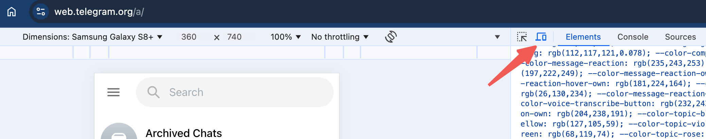
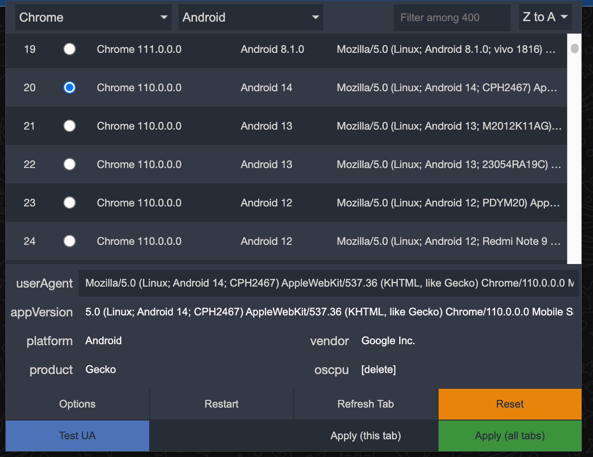

# Telegram WebApp Platform Modifier

Modify the platform parameter `tgWebAppPlatform` to `android` so that it allows you to run Telegram WebApps in the web version of Telegram.

To use this, install a user script manager (e.g. https://www.tampermonkey.net/), then go to https://github.com/hongshibao/tg-webapp-platform-modifier/raw/main/platform-modifier.user.js, and it will prompt you to install.

Telegram WebApps may also check the User-Agent. If you are using Chrome, you can press `F12`, click the device toolbar, and then select a suitable mobile device:

Another way to solve the User-Agent issue is to install Chrome User-Agent related extensions, e.g. [User-Agent Switcher and Manager](https://chromewebstore.google.com/detail/user-agent-switcher-and-m/bhchdcejhohfmigjafbampogmaanbfkg), and config them to use Android related User-Agent:

